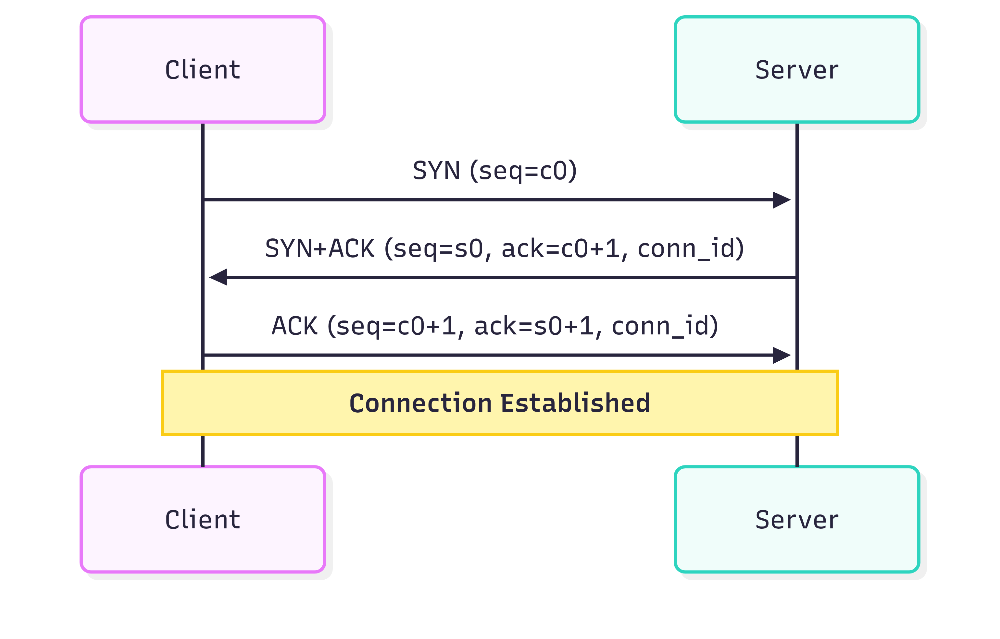
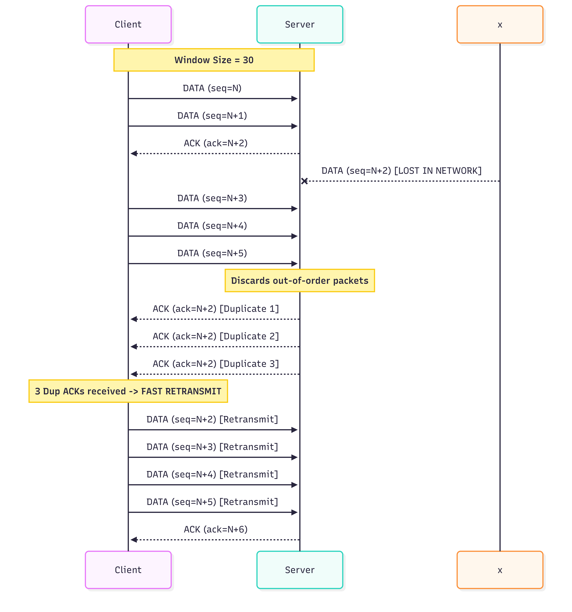
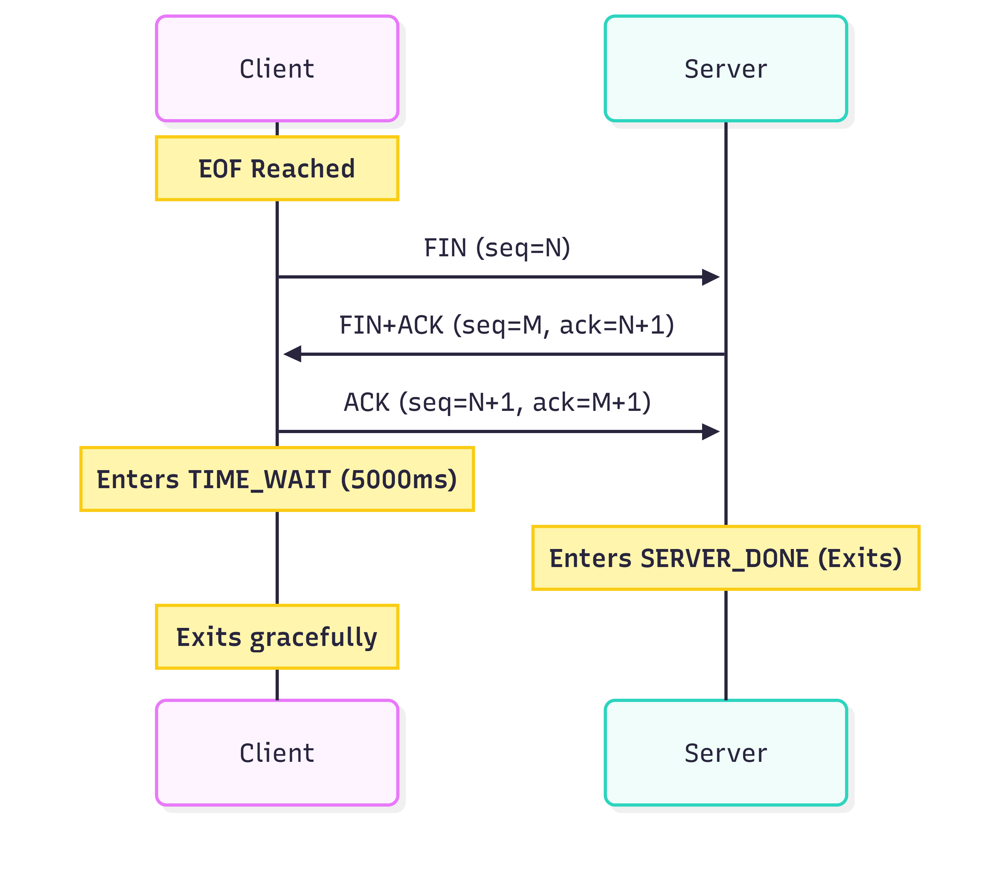
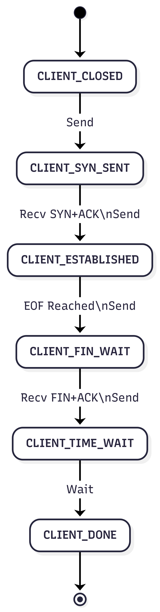
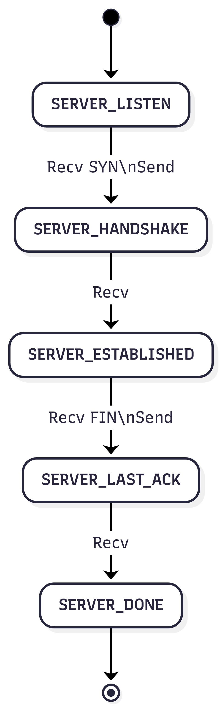

# IPK Project 2 - Reliable File Transfer over UDP

**Author:** Andrej Bližnák (xblizna00)  
**Date:** March 2026-05-03

## 1. Project Overview
`ipk-rdt` is a UDP-based client/server that transfers a single continuous byte stream with reliability, ordering, and integrity. It implements a custom transport protocol inspired by TCP, including session establishment, Go-Back-N data transfer, and clean termination.

## 2. Build and Run

### 2.1 Required Environment
This project is intended for the reference `x86_64-linux` environment with the Nix devShell.

```bash
make NixDevShellName
```

Expected output:

```text
c
```

### 2.2 Build

```bash
make clean
make
```

This produces the `ipk-rdt` binary in the project root.

### 2.3 Running the Program

Server:

```bash
./ipk-rdt -s -p 9000 -o received.bin
```

Client:

```bash
./ipk-rdt -c -a 127.0.0.1 -p 9000 -i sample.bin
```

Stdin to stdout:

```bash
./ipk-rdt -s -p 9000
printf "IPK\n" | ./ipk-rdt -c -a 127.0.0.1 -p 9000
```

## 3. Program Usage

Server:

```bash
./ipk-rdt -s -p PORT [-a ADDRESS] [-o OUTPUT] [-w TIMEOUT] [-h | --help]
```

Client:

```bash
./ipk-rdt -c -a HOST -p PORT [-i INPUT] [-w TIMEOUT] [-h | --help]
```

### 3.1 Arguments
- `-h`, `--help`: prints help to stdout and exits with code 0.
- `-s`: server mode.
- `-c`: client mode.
- `-p PORT`: UDP port number.
- `-a ADDRESS`: server bind address (optional).
- `-a HOST`: client destination hostname or IPv4/IPv6 address.
- `-i INPUT`: client input file (or `-` for stdin).
- `-o OUTPUT`: server output file (or `-` for stdout).
- `-w TIMEOUT`: maximum allowed interval without protocol progress (seconds), default 1.

Arguments can be provided in any order.

## 4. Protocol Architecture & Design

### 4.1 Packet/Header Format
The protocol uses a fixed 15-byte custom header, designed for minimal overhead while providing connection-oriented, TCP-like reliability. The design choices were heavily inspired by standard networking principles outlined in "Computer Networking: A Top-Down Approach" (Kurose & Ross).

| Field        | Size (bytes) | Description                       |
|--------------|--------------|-----------------------------------|
| `seq_num`    | 4            | Packet sequence number. A 32-bit integer provides enough space to transfer up to 4 GiB of data (given the 1200 B payload) before sequence wraparound occurs. |
| `ack_num`    | 4            | Cumulative ACK number. Represents the sequence number of the next expected packet. |
| `conn_id`    | 2            | Connection identifier. A 16-bit ID is sufficient to differentiate concurrent connections and ignore delayed/stray packets from older sessions. |
| `checksum`   | 2            | Standard Internet checksum calculated over the entire header and payload (adopted from RFC 1071 and repurposed from previous project). |
| `payload_len`| 2            | Explicit payload length (0-1185 B), eliminating the need to rely purely on UDP packet size. |
| `flags`      | 1            | `SYN`, `ACK`, `FIN`, `DATA`. A single byte is more than sufficient for storing 4 distinct bit-flags without unnecessary space consumption. |

*Note on memory layout:* The header is defined using `__attribute__((packed))` to ensure it occupies exactly 15 bytes in memory without compiler padding. Maximum UDP payload is 1200 bytes, leaving exactly 1185 bytes for data payload.

### 4.2 Session Establishment (3-Way Handshake)



### 4.3 Data Transfer (Go-Back-N)
Data transfer uses a Go-Back-N (GBN) protocol with cumulative ACKs and a cyclic buffer. A cyclic buffer allows continuous reading of chunks and efficient memory management by continuously reusing the memory space of acknowledged packets for newly read data. Sequence numbers are per-packet (not per-byte).

**Why Go-Back-N:** 
The decision to implement Go-Back-N instead of Selective Repeat was made to reduce complexity on the receiver's side, as initially recommended by peers and literature (Kurose). A GBN receiver does not need to allocate buffers for out-of-order packets or sort them; it simply maintains a single `ack_num` state and discards anything out of order. While this simplifies the implementation, it did introduce challenges during high packet loss scenarios, which are documented in the *Known Limitations* section.



### 4.4 Session Termination



## 5. Reliability Mechanisms

### 5.1 Acknowledgements
The receiver sends cumulative ACKs (`ack_num` = next expected packet sequence). Duplicates or out-of-order packets do not advance `ack_num`.

### 5.2 Retransmission Strategy
- **Internal vs. Global Timer:** While the user-specified `-w TIMEOUT` serves as a global session watchdog (causing an application exit if no overall progress is made), the protocol utilizes a finer internal timer of **250 ms** specifically designed for rapid packet loss detection and recovery without terminating the program.

- **Window Retransmission:** The sender maintains a sliding window of unacknowledged packets. The retransmission timer is tied to the oldest unacknowledged packet (`base`). On timeout, the sender retransmits all packets currently in flight within the window, which is standard GBN behavior.

- **Fast Retransmit:** To optimize recovery speed, a simplified version of TCP's Fast Retransmit (inspired by Kurose) is implemented. If the sender receives **3 duplicate ACKs** (the same `ack_num` consecutively), it assumes the packet was lost and immediately retransmits the entire window without waiting for the 250 ms timer to expire. Unlike TCP (which resends a single packet), the entire window is resent to stay true to the Go-Back-N philosophy.

### 5.3 Duplicate and Out-of-Order Handling
- Receiver accepts only the next expected sequence number.
- Out-of-order packets are discarded.
- Duplicate packets do not advance state.

### 5.4 Connection Identification
Each session is identified by a 16-bit `conn_id` chosen by the server during handshake to prevent cross-session confusion.

### 5.5 Timeout Semantics
`-w TIMEOUT` defines the maximum allowed interval without protocol progress. Progress means:
- a successful handshake step,
- an ACK that advances the window,
- arrival of a new (not duplicate) data packet,
- a successful termination step.

If no progress occurs for `TIMEOUT` seconds, the application exits with a non-zero code.

### 5.6 Window Configuration
The sender window size is fixed at **30 packets**. This value was determined empirically through extensive testing under various impairment conditions:
- A smaller window (e.g., 10-15 packets) resulted in significantly degraded throughput and frequent timeouts, as it behaved too similarly to a Stop-and-Wait protocol.

- A larger window (e.g., 40-50 packets) proved inefficient during early packet loss events, as Go-Back-N forces the retransmission of every packet following the lost one, leading to massive and unnecessary network congestion.

- The value of 30 represents an optimal balance between pipelining speed and recovery cost.

## 6. Implementation Notes
- Client and server are implemented as FSMs with explicit states.
- Shared utilities (checksum, packet build/parse, timers) are in common modules.
- All informational and error output is written to stderr.

### 6.1 Finite State Machines (FSM)
The architecture of both the client and the server is strictly driven by Finite State Machines, ensuring robust transition handling and clean protocol tear-downs.

**Client FSM:**


**Server FSM:**


## 7. Testing

Run unit and integration tests:

```bash
make test
```

Network impairment tests (tc netem) require root:

```bash
sudo make test
```

### 7.1 Test Suites
- Unit tests: parser, protocol serialization/checksum, GBN window logic.
- E2E data tests: empty input, binary payloads, file/stdin/stdout variants.
- E2E network tests: loss, duplication, reordering, jitter (tc netem).
- E2E system tests: timeouts, signals, IPv6, garbage packets.

### 7.2 Test Environment
- Environment: Linux (x86_64 Nix devShell `c`) running under WSL2 on Windows 11
- Loopback interface `lo`
- `tc netem` for loss/duplication/reorder/jitter

### 7.3 Observed Results (Development)
- Data, IO, and system suites pass locally.
- Network tests pass up to moderate loss; under higher loss with short `-w` timeout, failures can occur (see Known Limitations).

### 7.4 Measured Performance
The following metrics were measured during the testing phase to observe the impact of protocol design choices (like Fast Retransmit and window sizing) under adversarial conditions.

**Testing Environment:**
* **Processor:** Intel Core i5-13600K
* **RAM:** 32 GB DDR5 (6000 MT/s)
* **OS:** Windows 11 (WSL2) running Linux (x86_64 Nix devShell)

**Observations (Transferring a 50 MB file):**
During early development, transferring 50 MB under a 20% packet loss environment with a window size of 10 and a 200 ms timeout took nearly **30 minutes**. Through iterative optimization—increasing the window size to 30, tweaking the internal timeout to 250 ms, and implementing the **Fast Retransmit** mechanism—the transfer time for the exact same scenario was drastically reduced to **4 minutes**.

| Scenario | File Size | Condition | Transfer Time |
| :--- | :--- | :--- | :--- |
| **Baseline** | 50 MB | Ideal (0% loss) | **0m5.637s** |
| **Moderate Loss** | 50 MB | 10% loss | **0m28.918s** |
| **High Loss** | 50 MB | 20% loss | **1m0.453s** |

All tests produced the expected results unless otherwise noted in the Known Limitations section.

## 8. Requirements Coverage (Summary)
- UDP-only transport: yes
- Client/server in one binary (`ipk-rdt`): yes
- IPv4/IPv6: yes
- File and stdin/stdout I/O: yes
- Ordered and reliable delivery: yes (Go-Back-N)
- Loss/reorder/duplication/jitter handling: yes (tested with tc netem)
- Session establishment/termination: yes (SYN/ACK and FIN/ACK)
- Integrity checks: yes (Internet checksum)
- Max UDP payload <= 1200 bytes: yes

## 9. Known Limitations
1. Sequence number wraparound is not handled; transfers are expected to remain below 4 GiB worth of packets.
2. Under extremely high packet loss conditions, performance may degrade due to the Go-Back-N retransmission strategy, which resends multiple packets even if only one was lost.
3. Network impairment tests require root privileges (`sudo make test`).

## 10. References
- "Computer Networking: A Top-Down Approach" (Kurose & Ross) - General transport layer concepts, Go-Back-N, and Fast Retransmit logic.
- RFC 768: User Datagram Protocol (UDP) - https://www.rfc-editor.org/rfc/rfc768
- RFC 1071: Computing the Internet Checksum - https://www.rfc-editor.org/rfc/rfc1071
- RFC 9293: Transmission Control Protocol (TCP) - Used as a structural inspiration for the 3-way handshake and connection teardown. https://www.rfc-editor.org/rfc/rfc9293
- Linux man pages https://man7.org/linux/man-pages/man2/select.2.html
- https://man7.org/linux/man-pages/man3/sysexits.h.3head.html
- Greatest C Testing Framework https://github.com/silentbicycle/greatest
- Stack overflow questions/references as. ssize_t, sento, ...

## 11. AI Usage Disclosure
Artificial Intelligence (LLMs) was utilized during the development of this project strictly as a supportive tool for the following tasks:
*   **Learning:** Clarifying complex networking concepts and protocol behaviors during the initial design phase.
*   **Build System:** Assisting with the adaptation and modification of the `Makefile` from a previous project.
*   **Documentation & Doxygen:** Grammar checking and proofreading. The core content, logic, and structure of the sentences are entirely my own original work.
*   **Testing:** Generating test boilerplate code. I explicitly defined the test scenarios, edge cases, and expected behaviors in natural language, and the AI was used purely to translate these requirements into executable code.
*   **Debugging:** Assisting in identifying potential edge cases (e.g., packet loss scenarios, handshake corner cases) and suggesting possible directions for investigation. All fixes and final implementations were designed, validated, and implemented independently.

The final protocol design, Go-Back-N logic, finite state machines, and the core C implementation are strictly my own work.